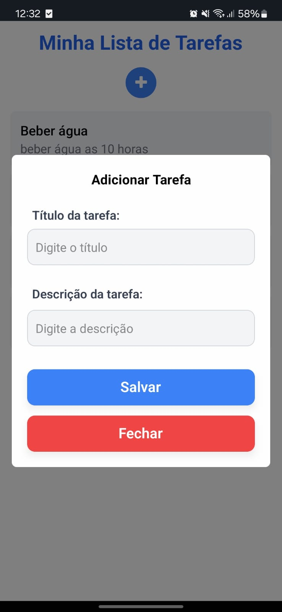

# 📝 Welcome to my to-do list project 👋

Simple project made in React Native with JavaScript to create a to-do list, I hope you like it :)

<!-- Imagem 1 -->


<!-- Imagem 2 -->


## Get started

> **Warning:** You need to install expo go on your mobile device, or use android studio.


1. CLone the repository

   ```bash
   git clone https://github.com/Renn4nn/to-do-list
   ```

2. Enter the project folder

   ```bash
   cd to-do-list
   ```
   
3. Install node_modules

   ```bash
   npm install
   ```

4. Start project

   ```bash
   npm start
   ```
